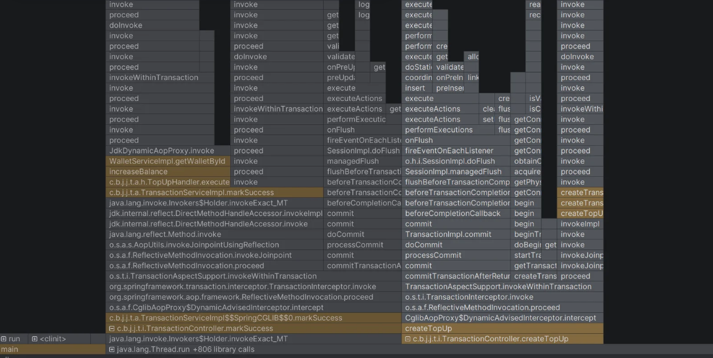
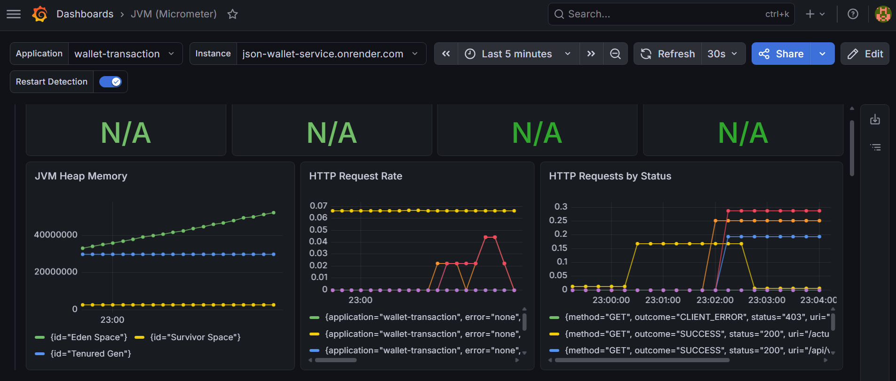

# Wallet Service - JSON Application

## Profiling

Profiling dilakukan pada wallet service menggunakan IntelliJ Profiler dengan mode CPU and Allocation Profiling, di mana service dijalankan secara lokal dan diberi beban menggunakan JMeter (200 request) agar method yang relevan terpanggil cukup banyak untuk dianalisis. Justifikasi pemilihan profiling secara lokal adalah karena service yang ter-deploy (Render) tidak memungkinkan attach profiler ke JVM-nya, dan pengukuran lokal lebih akurat untuk mengisolasi performa kode aplikasi. Dua method critical yang di-profile adalah createTopUp (operasi write) dan markSuccess (operasi read, update, dan strategy pattern). Hasil flame graph menunjukkan bahwa mayoritas waktu eksekusi pada kedua method dihabiskan di operasi database. Bottleneck utama berada pada I/O database (network round-trip ke Supabase yang berlokasi di cloud). Dengan demikian, improvement yang berpotensi dilakukan bukan pada optimasi kode melainkan pada sisi infrastruktur, seperti tuning connection pool (HikariCP) dan lain sebagainya.  

## Monitoring

Implementasi monitoring pada wallet service menggunakan Spring Boot Actuator yang mengekspos metrics melalui endpoint /actuator/prometheus, kemudian di-scrape oleh Prometheus setiap 5 detik dan divisualisasikan dalam dashboard Grafana. Grafana menyediakan visualisasi yang fleksibel dan mudah diakses. Setup di-containerize menggunakan Docker Compose.  
Tiga panel dashboard yang dibuat:  
1. JVM Heap Memory -> memantau pemakaian memori dan siklus garbage collection
2. HTTP Request Rate -> memantau jumlah request per detik  
3. HTTP Requests by Status -> memantau distribusi status code seperti 200 dan 403  

Dengan ini, kondisi runtime aplikasi baik dari sisi resource JVM maupun trafik aplikasi dapat dipantau secara real-time.